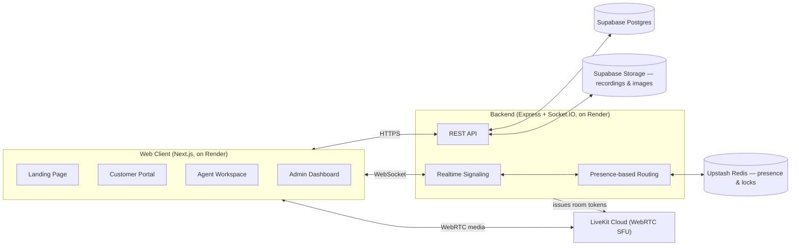

<div align="center">

# CallIQ

**A real-time WebRTC contact-center platform — voice, chat, live supervision, and analytics in one workspace.**

[](server/)
[](web/)
[](https://livekit.io)
[](https://supabase.com)
[](server/)
[](https://render.com)
[](LICENSE)

</div>

---

## Overview

CallIQ is a full-stack contact-center platform built to demonstrate how modern WebRTC
infrastructure, real-time signaling, and thoughtful UX come together to replace a traditional
call-center stack. Customers reach a business through a single product catalogue — one click to
talk over voice, or to chat — and are routed automatically to the right available agent.
Supervisors get a live operations view with the ability to listen in, whisper coaching to an
agent mid-call (which puts the customer on hold while the agent and supervisor talk privately), or
barge in directly as a visible third participant.

It was built as an end-to-end systems project: signaling, media routing, presence-based routing,
role-based auth, a managed Postgres data layer, and cloud object storage, all designed and wired
together from scratch and deployable entirely on free-tier infrastructure.

## Key Features

- **One-click voice & chat** — customers call or text an agent per product, no phone number or
  IVR tree required.
- **Smart routing** — voice calls go to the longest-idle assigned agent; chats ring every
  available agent at once, first to accept wins.
- **Live supervision** — admins can silently listen, whisper privately to an agent while the
  customer is held, or barge into any live call as a visible third participant — each mode cleanly
  reverts the call to normal the moment the supervisor leaves.
- **Unified login** — a single `email` + `password` login resolves the account's role
  automatically; no separate portals to remember.
- **Agent workspace** — personal availability control, an assigned-product queue, call history
  with one-click callback, and a personalized dashboard of the agent's own stats and customer
  reviews.
- **Customer feedback** — a lightweight post-call rating flow (professionalism, call quality,
  resolution, overall) feeds directly into each agent's personal reputation and the admin's
  aggregate analytics.
- **Product catalogue with images** — admins upload a photo per product (Supabase Storage-backed)
  shown on every customer-facing product card.
- **Quotations** — agents generate a priced quotation from any call or chat thread; customers
  accept or reject it, and every quotation is downloadable as a formatted PDF.
- **Admin analytics dashboard** — live call/chat volume, completion rate, disposition breakdown,
  agent-status board, and average customer satisfaction, visualized with clean, accessible charts.
- **Call recording & playback** — every call is captured to cloud storage and available for review
  from both the agent's and admin's side.
- **Light & dark mode** — a single icon-only toggle, available consistently across every screen.

## Architecture



Every backing service is a managed, free-tier cloud product — there is no self-hosted
infrastructure to operate. Local development connects to the same Supabase/LiveKit
Cloud/Upstash projects as production, so there is exactly one data layer to reason about.

## Tech Stack

| Layer              | Technology                                                |
|--------------------|------------------------------------------------------------|
| Frontend           | Next.js 14 (App Router), React 18, Tailwind CSS, Zustand    |
| Realtime           | Socket.IO, Upstash Redis                                    |
| Media / WebRTC     | LiveKit Cloud                                                |
| Backend API        | Node.js, Express                                             |
| Database           | Supabase (managed Postgres)                                  |
| File storage       | Supabase Storage (call recordings, product images)            |
| Charts             | Recharts                                                       |
| Documents          | PDFKit (quotation PDFs)                                        |
| Icons              | Lucide                                                          |
| Hosting            | Render (two free-tier web services)                              |

## Getting Started

**Prerequisites:** Node.js 20+, a free [Supabase](https://supabase.com) project, a free
[LiveKit Cloud](https://livekit.io) project, and a free [Upstash](https://upstash.com) Redis
database.

```bash
# 1. Clone
git clone https://github.com/amishasinha18/CallIQ.git
cd CallIQ

# 2. Configure environment
cp server/.env.example server/.env
cp web/.env.local.example web/.env.local
# fill in server/.env with your Supabase / LiveKit Cloud / Upstash values (see below)

# 3. Apply the database schema, then load the seed data
cd server && npm install
psql "$DATABASE_URL" -f db/schema.sql   # or paste db/schema.sql into the Supabase SQL Editor
npm run migrate

# 4. Install the frontend, then run both
cd ../web && npm install
cd .. && pm2 start ecosystem.config.js
```

Frontend: `http://localhost:4200` · Backend API: `http://localhost:4100`

`server/.env` needs, at minimum:

| Variable | Where to get it |
|---|---|
| `DATABASE_URL` | Supabase → Project Settings → Database → **Connection pooling** URI (not the direct connection — it's IPv6-only on the free tier) |
| `SUPABASE_URL` / `SUPABASE_SERVICE_ROLE_KEY` | Supabase → Project Settings → API |
| `REDIS_URL` | Upstash → your database → the `rediss://` TLS connection string |
| `LIVEKIT_URL` / `LIVEKIT_HTTP_URL` / `LIVEKIT_API_KEY` / `LIVEKIT_API_SECRET` | LiveKit Cloud → your project → Settings → Keys |

Also create two Supabase Storage buckets before first run: `recordings` (private) and
`product-images` (public) — see [`docs/DEVELOPMENT.md`](docs/DEVELOPMENT.md) for full detail.

Full setup detail, service ports, seed accounts, and design/implementation notes live in
[`docs/DEVELOPMENT.md`](docs/DEVELOPMENT.md).

## Deployment (Render, free tier)

The repo includes a `render.yaml` Blueprint that provisions both services in one step:

1. Push this repo to your own GitHub account.
2. In Render: **New +** → **Blueprint** → connect the repo. Render reads `render.yaml` and
   creates two web services, `calliq-server` and `calliq-web`.
3. On `calliq-server`, fill in the env vars marked `sync: false` in `render.yaml`
   (`JWT_SECRET`, `DATABASE_URL`, `REDIS_URL`, `LIVEKIT_URL`, `LIVEKIT_HTTP_URL`,
   `LIVEKIT_API_KEY`, `LIVEKIT_API_SECRET`, `SUPABASE_URL`, `SUPABASE_SERVICE_ROLE_KEY`) — the
   same values from your local `server/.env`.
4. Deploy. `CORS_ORIGIN` and `NEXT_PUBLIC_API_URL` are already wired to each other's Render URL
   in `render.yaml`, since both service names are fixed — no manual URL round-trip needed.
5. Confirm `https://calliq-server.onrender.com/health` and `https://calliq-web.onrender.com`
   both load, then log in with a seed account.

## Project Structure

```
├── web/                    Next.js frontend — landing page, customer/agent/admin portals
├── server/                 Express + Socket.IO backend — REST API, routing, signaling
│   ├── db/schema.sql       Postgres schema (apply once per Supabase project)
│   └── scripts/            One-time JSON → Postgres migration script
├── db/                     Historical JSON snapshot (migration source only, not live data)
├── render.yaml             Render Blueprint — both services, one file
└── docs/                   Engineering notes and implementation detail
```

## Status

This is an actively developed portfolio/demo project. Core flows — auth, routing, live voice,
chat, supervision, quotations, feedback, product catalogue, and analytics — are complete, backed
by managed Postgres/Storage/Redis/WebRTC infrastructure, and deployable end to end on free tiers.
See [`docs/DEVELOPMENT.md`](docs/DEVELOPMENT.md) for known limitations and the roadmap.

## License

MIT
