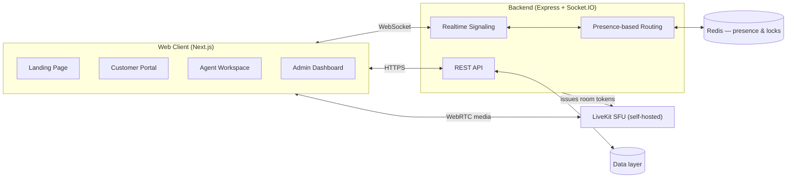

<div align="center">

# CallIQ

**A real-time WebRTC contact-center platform — voice, chat, live supervision, and analytics in one workspace.**

[](server/)
[](web/)
[](livekit/)
[](server/)
[](LICENSE)

</div>

---

## Overview

CallIQ is a full-stack, self-hosted contact-center platform built to demonstrate how modern
WebRTC infrastructure, real-time signaling, and thoughtful UX come together to replace a
traditional call-center stack. Customers reach a business through a single product catalogue —
one click to talk over voice, or to chat — and are routed automatically to the right available
agent. Supervisors get a live operations view with the ability to listen in, whisper coaching to
an agent mid-call, or barge in directly, all without the customer ever knowing.

It was built as an end-to-end systems project: signaling, media routing, presence-based routing,
role-based auth, and a data/reporting layer, all designed and wired together from scratch rather
than assembled from a call-center SaaS template.

## Key Features

- **One-click voice & chat** — customers call or text an agent per product, no phone number or
  IVR tree required.
- **Smart routing** — voice calls go to the longest-idle assigned agent; chats ring every
  available agent at once, first to accept wins.
- **Live supervision** — admins can silently listen, privately whisper to an agent, or barge into
  any live call as a third participant.
- **Unified login** — a single `email` + `password` login resolves the account's role
  automatically; no separate portals to remember.
- **Agent workspace** — personal availability control, assigned-product queue, call history with
  one-click callback, and a personalized dashboard of the agent's own stats and customer reviews.
- **Customer feedback** — a lightweight post-call rating flow (professionalism, call quality,
  resolution, overall) feeds directly into each agent's personal reputation and the admin's
  aggregate analytics.
- **Quotations** — agents generate a priced quotation from any call or chat thread; customers
  accept or reject it, and every quotation is downloadable as a formatted PDF.
- **Admin analytics dashboard** — live call/chat volume, completion rate, disposition breakdown,
  agent-status board, and average customer satisfaction, visualized with clean, accessible charts.
- **Call recording & playback** — every call is captured and available for review from both the
  agent's and admin's side.
- **Light & dark mode** — a single icon-only toggle, available consistently across every screen.

## Architecture



## Tech Stack

| Layer            | Technology                                              |
|-------------------|----------------------------------------------------------|
| Frontend          | Next.js 14 (App Router), React 18, Tailwind CSS, Zustand |
| Realtime          | Socket.IO, Redis                                          |
| Media / WebRTC     | Self-hosted LiveKit SFU                                   |
| Backend API        | Node.js, Express                                          |
| Charts            | Recharts                                                   |
| Documents          | PDFKit (quotation PDFs)                                    |
| Icons              | Lucide                                                     |
| Process management | PM2                                                        |

## Getting Started

**Prerequisites:** Node.js 18+, Redis, and a LiveKit server (self-hosted binary or LiveKit Cloud).

```bash
# 1. Clone
git clone https://github.com/amishasinha18/CallIQ.git
cd CallIQ

# 2. Configure environment
cp server/.env.example server/.env
cp web/.env.local.example web/.env.local
# edit both files with your own secrets / LiveKit credentials

# 3. Install dependencies
cd server && npm install
cd ../web && npm install

# 4. Run (from the repo root, via PM2)
pm2 start ecosystem.config.js
```

Frontend: `http://localhost:4200` · Backend API: `http://localhost:4100`

Full setup detail, service ports, seed accounts, and design/implementation notes live in
[`docs/DEVELOPMENT.md`](docs/DEVELOPMENT.md).

## Project Structure

```
├── web/         Next.js frontend — landing page, customer/agent/admin portals
├── server/      Express + Socket.IO backend — REST API, routing, signaling
├── livekit/     Self-hosted LiveKit SFU configuration
├── db/          JSON-backed data layer (drop-in replaceable with a real database)
├── recordings/  Locally stored call recordings
└── docs/        Engineering notes and implementation detail
```

## Status

This is an actively developed portfolio/demo project. Core flows — auth, routing, live voice,
chat, supervision, quotations, feedback, and analytics — are complete and working end to end.
See [`docs/DEVELOPMENT.md`](docs/DEVELOPMENT.md) for known limitations and the roadmap.

## License

MIT
